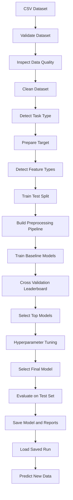
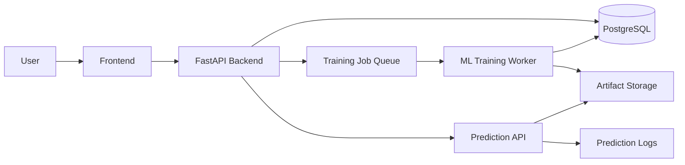

<div align="center">

# AutoML SaaS Engine

### A reusable AutoML engine for tabular classification and regression

Automatically inspect datasets, preprocess features, compare models, tune hyperparameters, evaluate performance, save trained pipelines, and generate predictions from new data.

[](https://www.python.org/)
[](https://scikit-learn.org/)
[](https://xgboost.readthedocs.io/)
[](https://pytest.org/)
[](CHANGELOG.md)
[](LICENSE)

</div>

---

## Overview

**AutoML SaaS Engine** is a reusable machine-learning engine for supervised tabular datasets.

A user provides:

- A CSV dataset
- The target column
- An optional task type
- A tuning mode
- Optional model-selection preferences

The engine then automatically:

1. Validates and inspects the dataset
2. Cleans duplicate and invalid records
3. Detects classification or regression
4. Encodes the target when required
5. Identifies numerical and categorical features
6. Builds leakage-safe preprocessing pipelines
7. Compares multiple machine-learning models
8. Performs cross-validation
9. Tunes the strongest models
10. Selects the final model
11. Evaluates it on an untouched test set
12. Saves the trained model and experiment reports
13. Reloads saved runs for predictions on new data

The current repository contains the completed **Phase 1 AutoML engine** and **Phase 2 modular Python package** for a future SaaS platform.

---

## Why This Project?

Training one model inside a notebook is relatively straightforward.

Building a reusable system that works across different datasets requires:

- Automated data validation
- Reusable preprocessing
- Classification and regression support
- Task-aware model selection
- Cross-validation
- Hyperparameter optimization
- Failure handling
- Experiment tracking
- Model serialization
- Input-schema validation
- Reproducible predictions
- Automated testing
- Modular software design

This project focuses on both machine-learning fundamentals and production-oriented ML engineering concepts.

---

## Workflow



---

## Features

### Dataset handling

- CSV validation
- Missing-file detection
- Empty-dataset detection
- Duplicate-column detection
- Whitespace cleanup for column names
- Duplicate-row removal
- Missing-target removal
- Constant-column removal
- Optional manual column removal
- Possible identifier-column detection
- Column-level data-quality reporting
- Dataset summary generation

### Automatic ML preparation

- Automatic classification and regression detection
- Manual task-type override
- Classification target-label encoding
- Regression target validation
- Numerical and categorical feature detection
- Median imputation for numerical features
- Most-frequent imputation for categorical features
- Numerical feature scaling
- One-hot encoding
- Unknown-category handling
- Saved input-schema generation

### Model evaluation

- Reproducible train/test splitting
- Stratified K-Fold for classification
- K-Fold for regression
- Dynamically selected fold counts
- Multiple evaluation metrics
- Model-stability measurement
- Failure-tolerant model evaluation
- Dummy baselines for comparison
- Baseline and tuned leaderboards
- Untouched final test-set evaluation

### Hyperparameter optimization

- Automatic selection of top-performing models
- `RandomizedSearchCV`
- Fast, balanced, and thorough tuning modes
- Model-specific search spaces
- Parameter-combination counting
- Baseline fallback when tuning does not improve performance
- Independent preprocessing and model pipelines

### Artifact management

- Complete fitted preprocessing and model pipeline
- Classification target encoder
- Input schema
- Model metadata
- Test metrics
- Test predictions
- Baseline leaderboard
- Tuned leaderboard
- Classification report
- Confusion matrix
- Column-quality report
- Baseline failure logs
- Tuning failure logs
- Artifact manifest

### Prediction support

- Load saved training runs
- Predict pandas DataFrames
- Predict new CSV files
- Validate required prediction columns
- Reject invalid numerical values
- Preserve extra identifier columns
- Decode classification predictions
- Return classification probabilities
- Safely handle unseen categorical values
- Save generated predictions to CSV

### Software quality

- Modular `src/` package structure
- Editable package installation
- Type annotations
- Unit tests
- Classification integration tests
- Regression integration tests
- Training-to-prediction workflow verification
- Pytest configuration
- Reproducible random states

---

## Supported Models

### Classification

| Model | Purpose |
|---|---|
| Dummy Classifier | Majority-class baseline |
| Logistic Regression | Regularized linear classification |
| K-Nearest Neighbors | Distance-based classification |
| Random Forest | Bagging-based tree ensemble |
| Extra Trees | Highly randomized tree ensemble |
| XGBoost | Gradient-boosted decision trees |

### Regression

| Model | Purpose |
|---|---|
| Dummy Regressor | Mean-prediction baseline |
| Ridge Regression | Regularized linear regression |
| K-Nearest Neighbors | Distance-based regression |
| Random Forest | Bagging-based tree ensemble |
| Extra Trees | Highly randomized tree ensemble |
| XGBoost | Gradient-boosted decision trees |

K-Nearest Neighbors is automatically excluded from the default registry for very large datasets to avoid expensive prediction workloads.

---

## Evaluation Metrics

### Classification

- Accuracy
- Balanced accuracy
- Macro precision
- Macro recall
- Macro F1
- ROC-AUC
- Per-class classification report
- Confusion matrix

**Macro F1** is used as the primary classification metric because it gives equal importance to each class rather than allowing the largest class to dominate model selection.

### Regression

- Mean Absolute Error
- Root Mean Squared Error
- R² score
- Residual values
- Absolute errors

**RMSE** is used as the primary regression model-selection metric.

---

## Installation

### 1. Clone the repository

```bash
git clone https://github.com/Kanishq2324/Auto-ML-Saas.git
cd Auto-ML-Saas
```

### 2. Create a virtual environment

Using `venv`:

```bash
python -m venv .venv
```

Windows:

```bash
.venv\Scripts\activate
```

macOS or Linux:

```bash
source .venv/bin/activate
```

Alternatively, create a Conda environment:

```bash
conda create -n automl-engine python=3.12 -y
conda activate automl-engine
```

### 3. Install the package

Install the package with development dependencies:

```bash
python -m pip install -e ".[dev]"
```

The editable installation means changes inside `src/automl_engine/` become available immediately without reinstalling the package.

### 4. Verify the installation

```bash
python -c "import automl_engine; print(automl_engine.__version__)"
```

Expected output:

```text
0.1.0
```

---

## Train a Model

```python
from automl_engine import run_automl

result = run_automl(
    csv_path="data/insurance.csv",
    target_column="charges",
    task_type="auto",
    tuning_mode="fast",
)

print("Task type:", result.task_type)
print("Final model:", result.final_model_name)
print("Selection source:", result.selection_source)
print("Final test metrics:", result.metrics)
print("Run directory:", result.run_directory)
```

The returned `AutoMLRunResult` object provides:

```python
result.run_directory
result.task_type
result.final_model_name
result.selection_source
result.metrics
result.cleaning_actions
result.dataset_summary
result.input_schema
result.baseline_leaderboard
result.tuned_leaderboard
result.evaluation_result
result.model_pipeline
result.target_encoder
result.artifacts
```

---

## Restrict Candidate Models

The engine normally evaluates every available model for the detected task.

For faster experimentation, provide a smaller model list:

```python
result = run_automl(
    csv_path="data/insurance.csv",
    target_column="charges",
    tuning_mode="fast",
    include_models=[
        "Ridge Regression",
        "Random Forest",
    ],
)
```

For classification:

```python
result = run_automl(
    csv_path="data/classification.csv",
    target_column="target",
    include_models=[
        "Logistic Regression",
        "Random Forest",
        "XGBoost",
    ],
)
```

---

## Available Tuning Modes

### Fast

```python
tuning_mode="fast"
```

- Tunes one selected model
- Uses a small randomized-search budget
- Best for testing and rapid experimentation

### Balanced

```python
tuning_mode="balanced"
```

- Tunes the two strongest models
- Uses a medium search budget
- Balances training time and model exploration

### Thorough

```python
tuning_mode="thorough"
```

- Tunes up to three strong models
- Uses a larger search budget
- Requires more computation

---

## Predict New Data

After training, use the saved run directory to predict another CSV:

```python
from automl_engine import predict_csv

predictions = predict_csv(
    run_directory="automl_runs/run_YYYYMMDD_HHMMSS",
    csv_path="data/new_customers.csv",
    output_path="predictions/customer_predictions.csv",
)

print(predictions.head())
```

Classification output can include:

```text
Prediction
Probability_no
Probability_yes
```

Regression output contains a continuous:

```text
Prediction
```

---

## Predict a DataFrame

```python
import pandas as pd

from automl_engine import predict_from_run

new_data = pd.DataFrame(
    {
        "customer_id": [101, 102],
        "age": [25, 50],
        "bmi": [21.5, 31.2],
        "region": ["north", "west"],
    }
)

predictions = predict_from_run(
    run_directory="automl_runs/run_YYYYMMDD_HHMMSS",
    dataframe=new_data,
)

print(predictions)
```

Extra columns such as `customer_id` are preserved in the output but are not passed into the trained model.

Unseen categorical values are safely handled by the fitted one-hot encoder.

---

## Experiment Results

### Lung Cancer Classification

| Metric | Score |
|---|---:|
| Selected model | XGBoost |
| Accuracy | 0.8929 |
| Balanced accuracy | 0.7292 |
| Macro F1 | 0.7551 |
| ROC-AUC | 0.9583 |

The model performed strongly overall but showed weaker recall for the minority class. This experiment demonstrated why class-aware metrics are more informative than accuracy alone for imbalanced classification.

> This dataset was used only to demonstrate the AutoML workflow. The resulting model is not a medical diagnostic system.

### Insurance Charge Regression

| Metric | Score |
|---|---:|
| Selected model | XGBoost |
| Cross-validation RMSE | 4573.44 |
| Test MAE | 2501.01 |
| Test RMSE | 4287.35 |
| Test R² | 0.90 |

The model explained approximately 90% of the variation in insurance charges.

The difference between MAE and RMSE indicates that some observations produced substantially larger prediction errors than the average observation.

---

## Generated Artifacts

Each AutoML execution creates a separate run directory:

```text
automl_runs/
└── run_YYYYMMDD_HHMMSS/
    ├── model_pipeline.joblib
    ├── target_encoder.joblib
    ├── metadata.json
    ├── input_schema.json
    ├── test_metrics.json
    ├── test_predictions.csv
    ├── column_report.csv
    ├── baseline_leaderboard.csv
    ├── tuned_leaderboard.csv
    ├── classification_report.csv
    ├── confusion_matrix.csv
    ├── baseline_failures.csv
    ├── tuning_failures.csv
    └── artifact_manifest.json
```

Some files are created only when relevant.

For example:

- Regression runs do not create a target encoder.
- Regression runs do not create a classification report.
- Failure files are created only when failures occur.

### Core deployment files

| File | Purpose |
|---|---|
| `model_pipeline.joblib` | Stores preprocessing and the fitted model |
| `target_encoder.joblib` | Converts encoded classes back to original labels |
| `input_schema.json` | Defines the expected prediction columns |
| `metadata.json` | Stores dataset, model, configuration, and run information |

### Evaluation files

| File | Purpose |
|---|---|
| `test_metrics.json` | Final held-out test performance |
| `test_predictions.csv` | Actual values and final model predictions |
| `baseline_leaderboard.csv` | Cross-validation performance before tuning |
| `tuned_leaderboard.csv` | Cross-validation performance after tuning |
| `classification_report.csv` | Per-class classification performance |
| `confusion_matrix.csv` | Actual-versus-predicted class counts |
| `column_report.csv` | Column types, missing values, and unique counts |

### Diagnostic files

| File | Purpose |
|---|---|
| `baseline_failures.csv` | Models that failed during baseline evaluation |
| `tuning_failures.csv` | Models that failed during hyperparameter tuning |
| `artifact_manifest.json` | Index of files created during the run |

---

## Project Structure

```text
Auto-ML-Saas/
├── notebooks/
│   ├── automl_demo.ipynb
│   └── AutoML.ipynb
├── src/
│   └── automl_engine/
│       ├── __init__.py
│       ├── config.py
│       ├── data.py
│       ├── preprocessing.py
│       ├── models.py
│       ├── tuning.py
│       ├── evaluation.py
│       ├── artifacts.py
│       ├── prediction.py
│       └── engine.py
├── tests/
│   ├── test_data.py
│   ├── test_preprocessing.py
│   ├── test_models.py
│   ├── test_tuning.py
│   ├── test_evaluation.py
│   ├── test_artifacts.py
│   ├── test_engine.py
│   ├── test_prediction.py
│   └── test_integration.py
├── data/
├── demo_output/
├── automl_runs/
├── predictions/
├── .gitignore
├── CHANGELOG.md
├── LICENSE
├── pyproject.toml
├── README.md
└── requirements.txt
```

The following generated directories are ignored by Git:

```text
data/
demo_output/
automl_runs/
predictions/
```

This prevents private datasets, generated predictions, and large trained-model files from being committed.

---

## Demonstration Notebook

Open:

```text
notebooks/automl_demo.ipynb
```

The notebook demonstrates:

- Creating a sample classification dataset
- Saving it as CSV
- Running the modular AutoML engine
- Inspecting the baseline leaderboard
- Inspecting tuned results
- Viewing final test metrics
- Viewing the confusion matrix
- Viewing the classification report
- Loading the saved model
- Generating decoded predictions
- Displaying class probabilities
- Inspecting generated artifacts

The notebook contains no core implementation logic.

Reusable code is maintained inside:

```text
src/automl_engine/
```

---

## Running Tests

Run the complete test suite:

```bash
python -m pytest -q
```

Run only unit tests for one module:

```bash
python -m pytest tests/test_tuning.py -q
```

Run the end-to-end integration tests:

```bash
python -m pytest tests/test_integration.py -q
```

The integration tests verify:

```text
Training CSV
    ↓
AutoML engine
    ↓
Model evaluation
    ↓
Artifact saving
    ↓
Artifact loading
    ↓
Prediction on new data
```

Both classification and regression workflows are tested.

---

## Reproducibility

The project uses:

```python
RANDOM_STATE = 42
```

The same random state is shared by:

- Train/test splitting
- Cross-validation
- Model initialization
- Randomized hyperparameter search

For a clean notebook validation run:

```text
Kernel → Restart Kernel and Run All Cells
```

For a clean package validation run:

```bash
python -m pytest -q
```

---

## Package Build

Build the package locally:

```bash
python -m build
```

This creates:

```text
dist/
├── automl_engine-0.1.0-py3-none-any.whl
└── automl_engine-0.1.0.tar.gz
```

The wheel can be installed with:

```bash
python -m pip install dist/automl_engine-0.1.0-py3-none-any.whl
```

---

## Current Limitations

Version `0.1.0` currently has the following limitations:

- CSV files only
- Tabular supervised learning only
- Classification and regression only
- No time-series forecasting
- No clustering
- No text, image, or audio modeling
- No grouped-data split strategy
- No automatic data-leakage detection
- No automatic model-drift monitoring
- No graphical interface
- No web API
- No persistent experiment database
- No automatic domain-specific feature engineering
- Large one-hot encoded datasets may require significant memory
- Hyperparameter tuning may be slow on limited hardware
- Task and feature-type detection use configurable heuristics

---

## Roadmap

### Phase 1 — Notebook AutoML prototype

- [x] Dataset validation
- [x] Automated preprocessing
- [x] Classification support
- [x] Regression support
- [x] Model comparison
- [x] Cross-validation
- [x] Hyperparameter tuning
- [x] Final test evaluation
- [x] Model artifact export
- [x] Saved-model inference

### Phase 2 — Modular AutoML package

- [x] Move reusable code into `src/`
- [x] Create installable Python package
- [x] Add shared configuration
- [x] Add data-processing module
- [x] Add preprocessing module
- [x] Add model registry
- [x] Add tuning module
- [x] Add final-evaluation module
- [x] Add artifact-management module
- [x] Add end-to-end engine controller
- [x] Add saved-model prediction support
- [x] Add unit tests
- [x] Add classification integration tests
- [x] Add regression integration tests
- [x] Add thin demonstration notebook
- [ ] Add structured logging
- [ ] Add HTML report generation
- [ ] Add feature-importance reports
- [ ] Add SHAP explanations
- [ ] Add optional feature engineering
- [ ] Add experiment comparison tools

### Phase 3 — SaaS backend

- [ ] FastAPI backend
- [ ] CSV upload endpoint
- [ ] Dataset validation endpoint
- [ ] Training-job endpoint
- [ ] Background training workers
- [ ] Job-status tracking
- [ ] PostgreSQL experiment database
- [ ] User authentication
- [ ] Team workspaces
- [ ] Model versioning
- [ ] Prediction API keys

### Phase 4 — SaaS frontend

- [ ] Dataset upload interface
- [ ] Target-column selector
- [ ] Training configuration page
- [ ] Live job-progress tracking
- [ ] Model leaderboard dashboard
- [ ] Evaluation charts
- [ ] Confusion-matrix visualization
- [ ] Regression residual charts
- [ ] Artifact downloads
- [ ] Prediction interface
- [ ] Model deployment interface

### Phase 5 — MLOps and deployment

- [ ] Docker containers
- [ ] Continuous integration
- [ ] Cloud deployment
- [ ] Object-storage integration
- [ ] Prediction logging
- [ ] Data-drift detection
- [ ] Model-performance monitoring
- [ ] Model rollback
- [ ] Usage quotas
- [ ] Subscription plans

---

## Engineering Concepts Demonstrated

- Reusable Python modules
- Python package structure
- Editable installations
- Type annotations
- Dataclasses
- Object serialization
- Automated data validation
- Scikit-learn pipelines
- Column transformers
- Missing-value imputation
- Numerical feature scaling
- One-hot encoding
- Cross-validation
- Hyperparameter optimization
- Classification and regression
- Imbalanced classification metrics
- Model-stability analysis
- Failure-tolerant training workflows
- Experiment artifact management
- Input-schema validation
- Saved-model inference
- Unit testing
- Integration testing
- Reproducible ML development
- Git-based project versioning

---

## Future SaaS Architecture



Possible future technology stack:

```text
Frontend
    React or Next.js

Backend
    FastAPI

Database
    PostgreSQL

Background jobs
    Celery or RQ

Queue
    Redis

Artifact storage
    Local storage, Amazon S3, or compatible object storage

Deployment
    Docker and cloud infrastructure
```

---

## Responsible Use

Model performance depends on:

- Dataset quality
- Target definition
- Sampling strategy
- Missing-data patterns
- Class imbalance
- Feature leakage
- Evaluation design
- Changes in real-world data

Models generated by this project should not be used for medical, financial, legal, insurance, safety-critical, or other high-impact decisions without:

- Domain-expert review
- Independent validation
- Fairness analysis
- Privacy and security assessment
- Regulatory review
- Production monitoring
- Human oversight

---

## Disclaimer

This project is currently intended for:

- Learning
- Experimentation
- Portfolio demonstration
- AutoML workflow development
- ML engineering practice
- Future SaaS development

The project is currently an alpha release and should not be treated as a fully managed production AutoML platform.

---

## License

This project is licensed under the MIT License.

See:

```text
LICENSE
```

for the complete license text.

---

## Author

**Kanishq**

GitHub: [@Kanishq2324](https://github.com/Kanishq2324)

---

<div align="center">

Built as a practical exploration of AutoML, machine-learning engineering, testing, MLOps, and SaaS development.

</div>